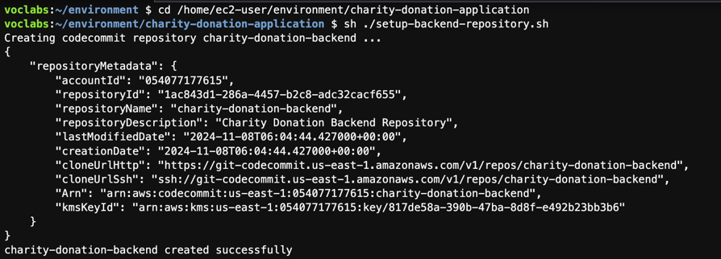
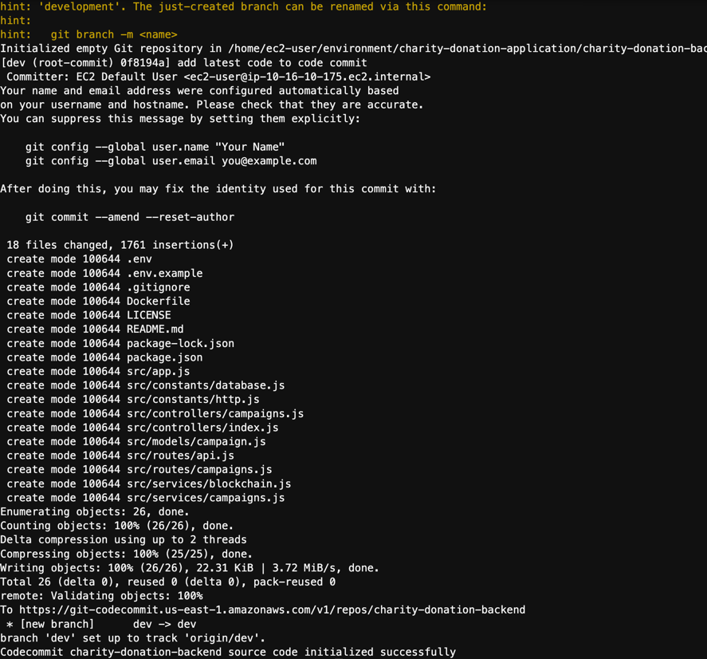
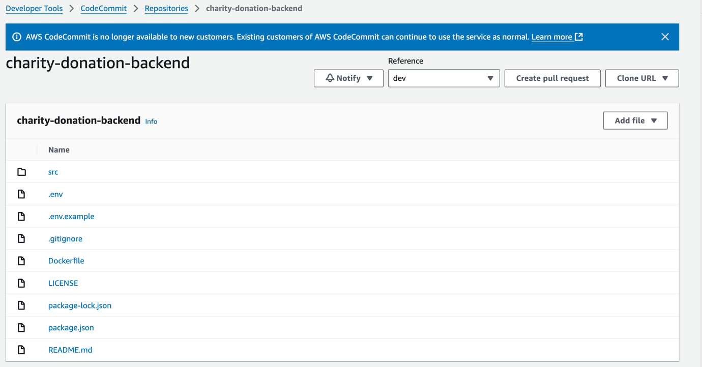
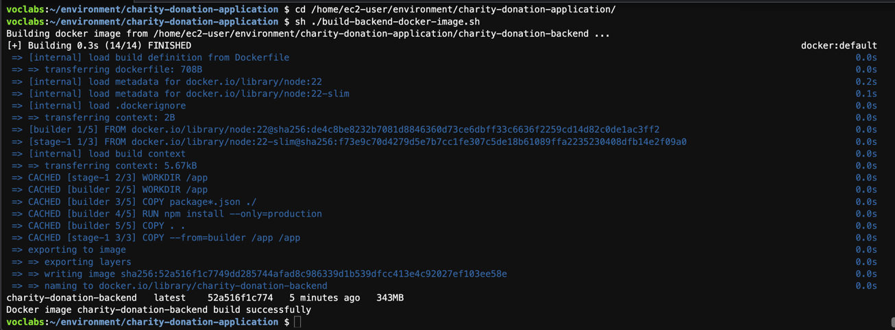
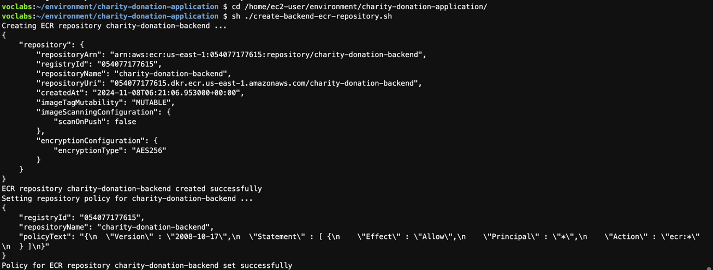
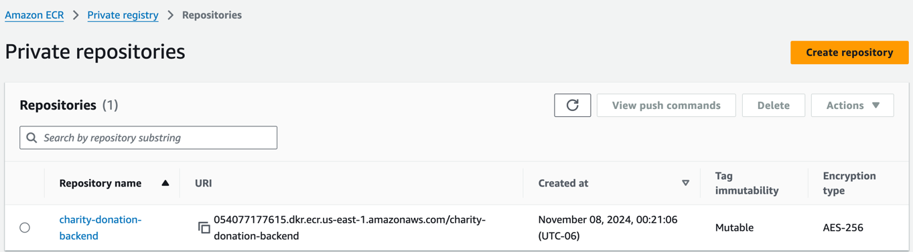
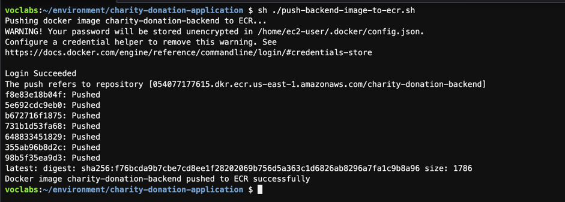
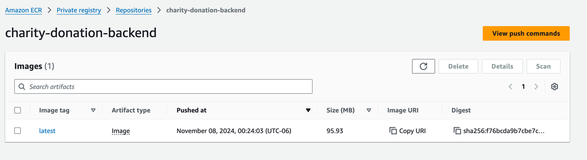
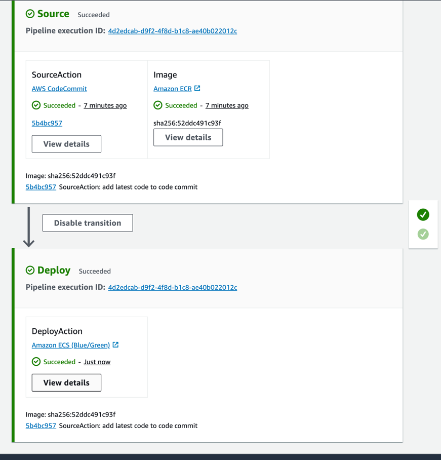

# DevOps

## Stage 1:
Set up the vpc, dynamodb, and cloud9 environment.
### Set up the VPC
Create the VPC by running the following command:
```bash
cd /home/ec2-user/environment/charity-donation-application/
sh ./charity-donation-deployment/setup-vpc.sh
```

## Stage 2:

To prepare for this stage, we need to have the following resources:
We are using the CI/CD lab for this stage: https://awsacademy.instructure.com/courses/92321/modules/items/8491173

We first create the Cloud9 environment as task 1.3 in the previous stage.
With the following settings:
- Name: charityDonationIDE
- Instance type: t3.small
- Platform: Amazon Linux
- Network settings:
  - VPC: LabVPC,
  - Subnet: Public Subnet1
  - Connection: SSH

Then upload the project file to the Cloud9 environment, which named `charity-donation-application.zip`.
Unzip the file after uploading by running the following command:
```bash
unzip charity-donation-application.zip
```
### Task 2.1: Migrate the application code to CodeCommit.
#### Backend (Node.js)
Create a new repository in CodeCommit named `charity-donation-backend`.
Then, push the backend code to the repository.
```bash
cd /home/ec2-user/environment/charity-donation-application
sh ./charity-donation-deployment/setup-backend-repository.sh
```

The charity-donation-backend repository is created in CodeCommit.


The source code is pushed to the repository.


The repository and source code is available in CodeCommit.


#### Frontend (React)
Create a new repository in CodeCommit named `charity-donation-frontend`.
Then, push the frontend code to the repository.
```bash
cd /home/ec2-user/environment/charity-donation-application
sh ./charity-donation-deployment/setup-frontend-repository.sh
```

### Task 2.2: Containerize the application using docker images in the Cloud9 environment.
#### Backend (Node.js)
Build the docker image for the backend application.
```bash
cd /home/ec2-user/environment/charity-donation-application/
sh ./charity-donation-deployment/build-backend-docker-image.sh
```

The docker image is built successfully.


#### Frontend (React)
Build the docker image for the frontend application.
```bash
cd /home/ec2-user/environment/charity-donation-application/
sh ./charity-donation-deployment/build-frontend-docker-image.sh
```

### Task 2.3: Push the docker images to the ECR.
#### Backend (Node.js)

Create a new repository in ECR named `charity-donation-backend`.
Then, push the backend docker image to the repository.
```bash
cd /home/ec2-user/environment/charity-donation-application/
sh ./charity-donation-deployment/create-backend-ecr-repository.sh
```

The charity-donation-backend repository is created in terminal.


The charity-donation-backend repository is created in ECR.



Push the backend docker image to the repository.
```bash
sh ./charity-donation-deployment/push-backend-image-to-ecr.sh
```

The backend docker image is pushed to the repository in terminal.


The backend docker image is pushed to the repository in ECR.


#### Frontend (React)

Create a new repository in ECR named `charity-donation-frontend`.
Then, push the frontend docker image to the repository.
```bash
cd /home/ec2-user/environment/charity-donation-application/
sh ./charity-donation-deployment/create-frontend-ecr-repository.sh
```

Push the frontend docker image to the repository.
```bash
sh ./charity-donation-deployment/push-frontend-image-to-ecr.sh
```

### Conclusion
In this second implementation stage, we successfully migrated the application code to CodeCommit, containerized the application using docker images in the Cloud9 environment, and pushed the docker images to the ECR. The backend and frontend applications are now available in the ECR repositories.
In the next stage, we are going to set up the ECS cluster for deployment. It involves creating the ECS cluster, task definition, and service for the backend and frontend applications.

### Setup all the resources in the stage 2
To setup all the resources in the stage 2, run the following command:
```bash
cd /home/ec2-user/environment/charity-donation-application/
sh ./charity-donation-deployment/setup-stage2.sh
```

## Stage 3
To prepare for this stage, we also need to set up Cloud9 and upload the project file to the Cloud9 environment, like in the stage 2.
In addition, we need to set up the DynamoDB table for the in the Learner Lab: https://awsacademy.instructure.com/courses/92322/modules/items/8491687.
The detail of setting up the DynamoDB table is in the task 1.2 of the of stage 1.

### Task 3.1: Create an ECS cluster with the name: blockchain-charity-cluster.
Create the ecs cluster by running the following command:
```bash
cd /home/ec2-user/environment/charity-donation-application/
sh ./charity-donation-deployment/create-ecs-cluster.sh
```

### Task 3.3: Create security groups, load balancers, and target groups for the ECS services.
Because the frontend needs to use the load balancer dns as the backend api url.
So we need to provision this task before run the task 3.2.

Create target groups for the frontend and backend by running the following command:
```bash
cd /home/ec2-user/environment/charity-donation-application/
sh ./charity-donation-deployment/create-target-group.sh
```

Setup security groups and load balancers for the ECS services by running the following command:
```bash
cd /home/ec2-user/environment/charity-donation-application/
sh ./charity-donation-deployment/setup-sg-lb.sh
```

### Task 3.2: Create task definitions for the application. One task definition for the backend API and one for the frontend web application.
Run this task after the task 3.1 and 3.3 are completed.

Create task definition for frontend by running the following command:
```bash
cd /home/ec2-user/environment/charity-donation-application/
sh ./charity-donation-deployment/create-frontend-task-definition.sh
```

Create task definition for backend by running the following command:
This command will require the AWS credentials to create the task definition.
Please provide the AWS credentials when prompted. The credentials can be gotten from Learner Lab or your own AWS account.
```bash
cd /home/ec2-user/environment/charity-donation-application/
sh ./charity-donation-deployment/create-backend-task-definition.sh
```

### Task 3.4: Create ECS services for the application. One service for the backend API and one for the frontend web application.
Create ECS services for the frontend by running the following command:
```bash
cd /home/ec2-user/environment/charity-donation-application/
sh ./charity-donation-deployment/create-frontend-ecs-service.sh
```

Create ECS services for the backend by running the following command:
```bash
cd /home/ec2-user/environment/charity-donation-application/
sh ./charity-donation-deployment/create-backend-ecs-service.sh
```

### Conclusion
In this third implementation stage, we successfully created an ECS cluster, task definitions, and services for the backend and frontend applications. The security groups, load balancers, and target groups were also set up for the ECS services. The applications are now ready for deployment in the ECS cluster.
In the final stage, we will set up the CI/CD pipeline for automated deployment of the applications.
The application should be accessible after the final stage is completed.

## Stage 4:

To prepare for this stage, we need to have the following resources:
- The Cloud9 environment set up in the previous stages.
- Create DynamoDB table in the Learner Lab: https://awsacademy.instructure.com/courses/92322/modules/items/8491687
- Get AWS credentials from the Learner Lab and copy them to your text editor for use in the following tasks.

We then need to provision the resources in the stage 2 and stage 3 before running the tasks in this stage.
```bash
cd /home/ec2-user/environment/charity-donation-application/
sh ./charity-donation-deployment/setup-stage2.sh
sh ./charity-donation-deployment/setup-stage3.sh
```

### Task 4.1: Create AppSpec files for the CodeDeploy deployment. One AppSpec file for the backend API and one for the frontend web application.
Just need to screenshot the AppSpec files in the repository.

### Task 4.2: Create CodeDeploy application and deployment groups.
Create CodeDeploy application and deployment groups
```bash
cd /home/ec2-user/environment/charity-donation-application/
sh ./charity-donation-deployment/setup-codedeploy.sh
```

Create codecommit repository for deployment
```bash
cd /home/ec2-user/environment/charity-donation-application/
sh ./charity-donation-deployment/setup-deployment-repository.sh
```

### Task 4.3: Create a pipeline for backend API in CodePipeline.
Create a pipeline for the backend API in CodePipeline by running the following command:
```bash
cd /home/ec2-user/environment/charity-donation-application/
sh ./charity-donation-deployment/setup-backend-pipeline.sh
```

After the pipeline is created, access the pipeline in the AWS Management Console.
https://us-east-1.console.aws.amazon.com/codesuite/codepipeline/pipelines/charity-donation-backend/view?region=us-east-1

You can run the next task while waiting for the pipeline to complete the deployment process.

### Task 4.4: Create a pipeline for the frontend web application in CodePipeline.
Create a pipeline for the frontend web application in CodePipeline by running the following command:
```bash
cd /home/ec2-user/environment/charity-donation-application/
sh ./charity-donation-deployment/setup-frontend-pipeline.sh
```

After the pipeline is created, access the pipeline in the AWS Management Console.
https://us-east-1.console.aws.amazon.com/codesuite/codepipeline/pipelines/charity-donation-frontend/view?region=us-east-1

Wait for the pipelines to complete the deployment process. 
The applications should be accessible after the deployment is completed.

The backend pipeline is created successfully looks like this:
